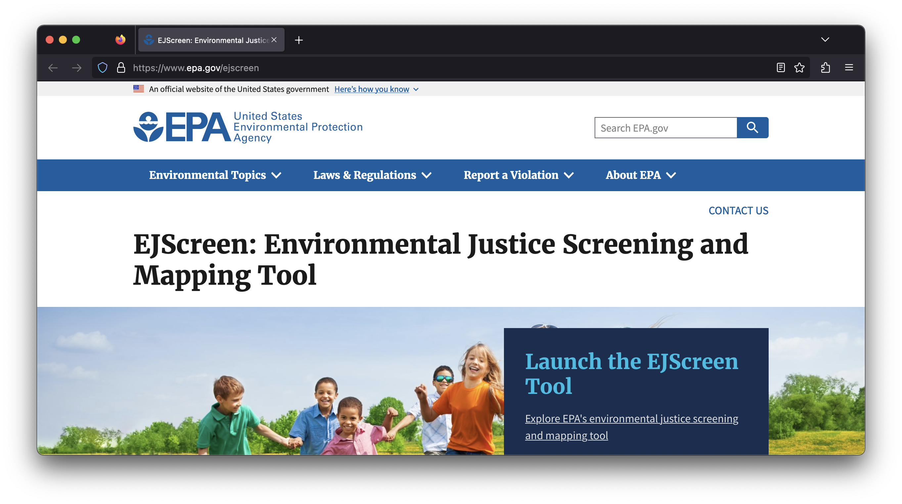

# About this Module {-}

This is a collection of modules intended to teach students about environmental justice through the [EPA's EJ Screen tool](https://www.epa.gov/ejscreen).

These modules use a three-tiered system to educate across experience levels.

