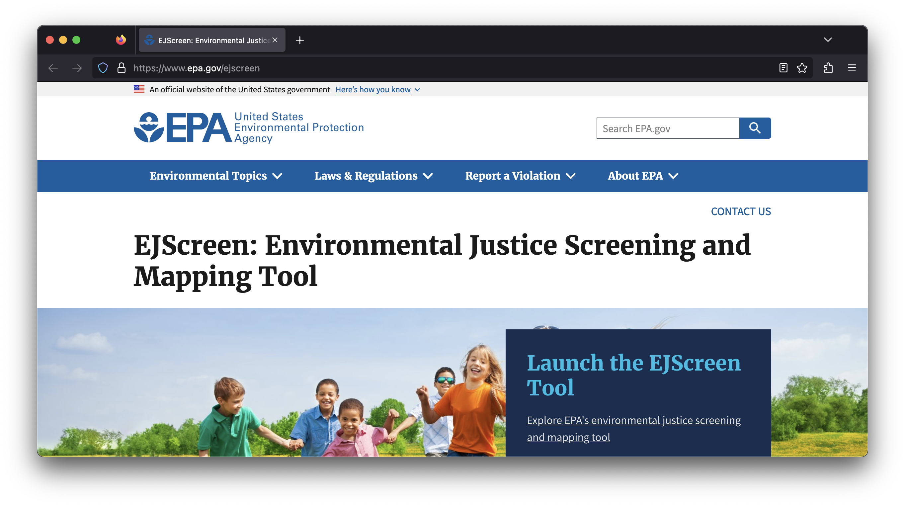

# (PART\*) Module - Tier 1 {-}

# Introduction

**Note fantastic slides from Lourdes Vera here: https://docs.google.com/presentation/d/1hGCkesvIgccjunUQzVRuHEp1aZNIDyMW9BdAonpN40M/edit#slide=id.p **

When organizations/governments need to make decisions that impact communities, they have to take a lot of information and condense it. It is not practical to go out to every site and measure every environmental variable in every location that they want to make a decision about. It costs money and takes time, both of which are always limited. The government/organizations will often look to easily-accessible data to make decisions about whether/how to do potentially damaging actions that impact the environment. 

We are going to show you one tool that people use to make decisions that can impact your community, EJ Screen. EJ Screen is an environmental justice screening and mapping tool.

First, let's take a look at the [EJ Screen](https://ejscreen.epa.gov/) website. Spend a few minutes poking around the site: What data are available? How are they represented?

