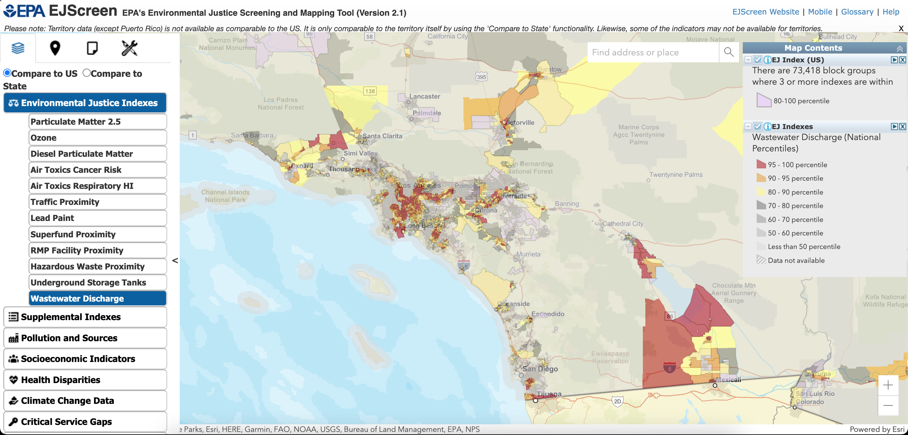
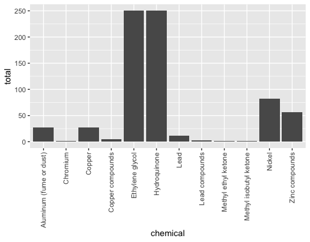

# (PART\*) Module - Tier 2 {-}

# Introduction

EJ Screen incorporates many different data sources. Let’s dig into one of the data sources that is part of EJ screen so we can understand it better.

We will import the data source used to make the  wastewater index that is part of the EJ screen tool.

# Activity

Looking at the EJ Screen website, wastewater discharge is an EJ factor in many Southern California regions.

We can dive into the data and look at the content of the wastewater in two different rural counties: Riverside and Imperial



We find that the chemical composition is very different! These are also counties with large amounts of agricultural run-off, but these are not accounted for in this database. The nitrate wastewater runoff in Imperial county is from the US Navy.





```r
library(ggplot2)
data <- read.csv(file = ‘TRI_table_CA2.csv’)
county_name = “IMPERIAL”
county = data[data$COUNTY_NAME == county_name,]
## What do the columns mean?
# TOTAL_PRODUCTION_RELATED_WASTE. = sum of all reports
# TOTAL_PRODUCTION_RELATED_WASTE..1 = average of all reports
# TOTAL_PRODUCTION_RELATED_WASTE..2 = count of reports
# county$TOTAL_PRODUCTION_RELATED_WASTE..5 = std of all reports
# county$TOTAL_PRODUCTION_RELATED_WASTE..6 = variance of all reports
## Plot total by facility
county1 = aggregate(x = county$TOTAL_PRODUCTION_RELATED_WASTE.,                # Specify data column
                    by = list(county$FACILITY_NAME),              # Specify group indicator
                    FUN = sum)
county1 <- county1[order(county1$x),]
p<-ggplot(data=county1, aes(x=Group.1, y=x)) +
  geom_bar(stat = ‘identity’)
p + theme(axis.text.x = element_text(angle = 90, vjust = 0.5, hjust=1))
## Plot total by chemical
chemical = aggregate(x = county$TOTAL_PRODUCTION_RELATED_WASTE.,                # Specify data column
                    by = list(county$CAS_CHEM_NAME),              # Specify group indicator
                    FUN = sum)
p<-ggplot(data=chemical, aes(x=Group.1, y=x)) +
  geom_bar(stat = ‘identity’)
p + theme(axis.text.x = element_text(angle = 90, vjust = 0.5, hjust=1))
## Plot chemicals that are released into the water
county_water <- county[county$WATER_TOTAL_RELEASE > 0,]
chemical = aggregate(x = county_water$WATER_TOTAL_RELEASE,                # Specify data column
                     by = list(county_water$CAS_CHEM_NAME),              # Specify group indicator
                     FUN = sum)
p<-ggplot(data=chemical, aes(x=Group.1, y=x)) +
  geom_bar(stat = ‘identity’)
p + theme(axis.text.x = element_text(angle = 90, vjust = 0.5, hjust=1))
```
